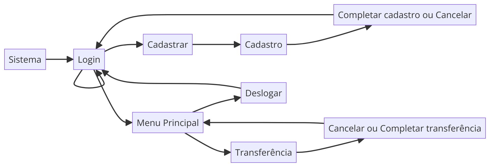
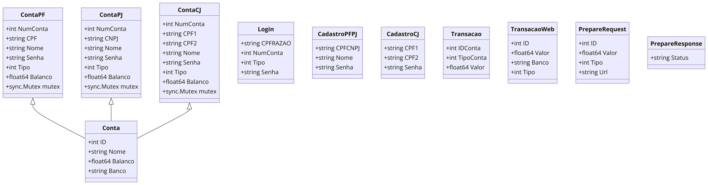
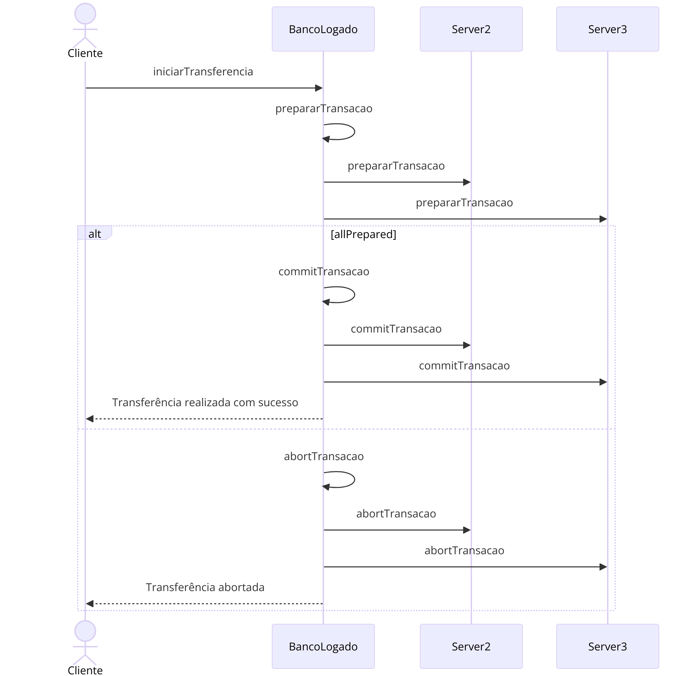

# PBL-REDES-2
## Sumário
+ [Introdução](#introdução)
+ [Como Utilizar o Sistema](#como-utilizar-o-sistema)
+ &nbsp;&nbsp;&nbsp;[Requisitos](#requisitos)
+ &nbsp;&nbsp;&nbsp;[Executando](#executando)
+ &nbsp;&nbsp;&nbsp;[Acesso ao Banco](#acesso-ao-banco)
+ [Estruturas Utilizadas Pelo Sistema](#estruturas-utilizadas-no-sistema)
+ &nbsp;&nbsp;&nbsp;[Estruturas utilizadas](#estruturas-utilizadas)
+ &nbsp;&nbsp;&nbsp;[Classes de Uso Via Web](#classes-de-uso-via-web)
+ &nbsp;&nbsp;&nbsp;[Estruturas de Uso Interno](#estruturas-de-uso-interno)

+ &nbsp;&nbsp;&nbsp;[Estruturas utilizadas pelo 2-Phase-Commit (2PC) implementado](#estruturas-utilizadas-pelo-2-phase-commit-2pc-implementado)
+ &nbsp;&nbsp;&nbsp;[Implementação do modelo de transação atômica](#implementação-do-modelo-de-transação-atômica)
+ [Conclusão](#conclusão)
_____
## Introdução
Este sistema bancário descentralizado foi minha solução proposta para o segundo problema da disciplina PLB de Concorrência e Conectividade - TEC502 da Universidade Estadual de Feira de Santana (UEFS) do semestre 24.1.

O problema pedia o desenvolvimento de um sistema descentralizado no qual um cliente pode utilizar o saldo de qualquer conta que o pertença (que seu CPF ou CNPJ esteja registrado como titular daquela conta) sendo esta do banco que ele está atualmente logado ou de qualquer outro banco participante do consorcio bancário para realizar transferências entre as contas dos bancos, e, estas transferências devem seguir um modelo de transação atômica para assegurar que não haja movimentação indevida dos saldos ou algum tipo de instabilidade que faça que o sistema realize uma transação indevida ou deixe uma operação incompleta.

Foi optado por desenvolver um consorcio de somente 3 bancos:
O Banco Bola Monetária Nacional (ou BBMN), o Banco Brasileirinho (ou BB) e o Banco Gringuesco (ou BG).
O modelo de transação atômica utilizado foi o 2-Phase-Commit (ou 2PC, para abreviar), o 2PC é baseado em dividir a transação em duas fases:
1. Fase de preparação: A fase de preparação envia um "pedido" que avisa os participantes para se prepararem para receber uma requisição, caso todos os participates avisem que estão prontos para receber a requisição, o algoritmo segue para a fase de commit. Caso algum participante retorne algum erro, o algoritmo entra em uma fase intermediaria, chamada de "abort".
2. Fase de Commit: Quando todos os participantes estão prontos para receber a requisição, o "atuador" (servidor/cliente) de origem envia a requisição (ou commit), e os participantes guardam ou atualizam os respectivos valores condizentes com o commit recebido. 
3. Fase de Abort: Quando algum participante retorna um erro, o algoritmo precisa cancelar todas as operações, esta fase envia um pedido de abort para todos os participantes. Esta fase garante atomicidade ao buscar garantir que sempre todos os participantes devem retornar um status de "Preparado".
----------------------------
## Como utilizar o sistema: 
### Requisitos:
O sistema foi desenvolvido utilizando Golang 1.22.2, então possuir o Golang no mínimo nesta versão
### Executando
Construa e suba as imagens docker para os containers e execute cada sistema bancário em um container.
Para construir a imagem docker, vá até a pasta que guarda um sistema bancário e digite no terminal:

` docker build . -t nome-do-banco `

Os bancos utilizam as portas para se diferenciarem, caso execute em computadores diferentes, será necessário alterar algumas FLAGS e linhas do código para que os códigos consigam acessar as rotas devidamente.

Para o BBMN:

`docker run --name nome-do-container --rm -p 65500:65500 nome-da-imagem`

Para o BB:
`docker run --name nome-do-container --rm -p 65502:65502 nome-da-imagem `

Para o BG:
`docker run --name nome-do-container --rm -p 65501:65501 nome-da-imagem `

### Acesso ao banco
No navegador, digite o ip:porta do banco desejado seguido de '/inicial' para ter acesso a tela de login.
Exemplo:
`https://localhost:65502/inicial`

Abaixo um fluxograma das paginas.

---------------------
## Estruturas utilizadas no sistema

### Estruturas utilizadas

Diagrama Geral de classes utilizadas no sistema.

#### Classes de uso via Web
Estas classes são utilizadas para receber JSON'S pelas rotas acessadas pelas paginas web.

##### Login

<figurecaption #align="center"> Classe de Login</figurecaption>

Esta estrutura é responsável por receber o json da requisição de login.

- CPFRAZAO - Guarda o CPF ou CNPJ que está a logar
- NumConta - O Numero (ID) daquela conta.
- TIPO - Guarda o tipo daquela conta, seja 1 uma conta de pessoa física e 2 Pessoa Jurídica
- Senha - A senha utilizada para login.
Classes e seus usos

##### Conta
Resposta da requisição "/getContas" que procura todas as contas associadas a um CPF ou CNPJ.

<figurecaption #align="center"> Classe de resposta ao solicitar dados da conta</figurecaption>

- ID - Representa o numero da conta.
- Nome - Nome Titular ou Empresarial da conta.
- Balanco - Saldo disponível na conta.
- Banco - Banco o qual esta conta pertence.

##### Transação
Utilizada internamente para realizar uma modificação local do saldo de uma conta.

<figurecaption #align="center"> Classe de transação local</figurecaption>

- ID - Numero da conta a receber a transação.
- TipoConta - Tipo da conta a receber a transação (PF:1, PJ:2, CJ:3)
- Valor - Quantia a ser reduzida/incrementada.

##### Transação Web
Utilizada para receber um pedido de transação via rota.

<figurecaption #align="center"> Classe de transação web</figurecaption>

- ID - Numero da conta alvo da transação.
- Valor - Valor a ser incrementado/decrementado do saldo.
- Banco - Banco o qual a conta pertence
- Tipo - Tipo da transação (1: Somar, 2: Decrementar)

#### Estruturas de uso interno
Estas estruturas são utilizadas somente internamente pelo servidor para representar os tipos de conta que é possível possuir no sistema.

##### Conta Pessoa Física
Como as contas de Pessoa Física são registradas no sistema.

<figurecaption #align="center"> Classe de conta Pessoa Física</figurecaption>

- NumConta - Representa o número identificador da conta
- CPF   - Representa o CPF titular da conta.
- Nome - Nome do titular da conta.
- Senha - Senha da conta.
- Tipo - Tipo da conta, utilizado para passar para a struct Conta, ao enviar as informações da conta.
- Balanco - Saldo disponível na conta.
- mutex - Objeto de sincronização para tratar concorrência, ao utilizar mutex.lock(), a conta fica bloqueada, permitindo somente que a função que bloqueou a conta modifique o saldo.

##### Conta Pessoa Jurídica
Como as contas de Pessoa Jurídica são registradas no sistema.

<figurecaption #align="center"> Classe de conta Pessoa Jurídica</figurecaption>

- NumConta - Representa o número identificador da conta
- CNPJ   - Representa o CNPJ titular da conta.
- Nome - Nome do Empresa titular da conta.
- Senha - Senha da conta.
- Tipo - Tipo da conta, utilizado para passar para a struct Conta, ao enviar as informações da conta.
- Balanco - Saldo disponível na conta.
- mutex - Objeto de sincronização para tratar concorrência, ao utilizar mutex.lock(), a conta fica bloqueada, permitindo somente que a função que bloqueou a conta modifique o saldo.

##### Conta Conjunta
Como as contas conjuntas são registradas no sistema.

<figurecaption #align="center"> Classe de conta conjunta</figurecaption>

- NumConta - Representa o número identificador da conta
- CPF1   - Representa o CPF  de um titular da conta.
- CPF2   - Representa o CPF  do outro titular da conta.
- Nome - Nome titular da conta.
- Senha - Senha da conta.
- Tipo - Tipo da conta, utilizado para passar para a struct Conta, ao enviar as informações da conta.
- Balanco - Saldo disponível na conta.
- mutex - Objeto de sincronização para tratar concorrência, ao utilizar mutex.lock(), a conta fica bloqueada, permitindo somente que a função que bloqueou a conta modifique o saldo.

### Estruturas utilizadas pelo 2-Phase-Commit (2PC) implementado
Estas estruturas são implementadas e utilizadas somente pelas rotas responsáveis por gerencias o 2PC

##### Prepare Request
Refere a primeira fase do 2PC, a fase de preparação, esta estrutura é enviada via a rota "/prepare" para os bancos participantes de uma transação para preparação das contas participantes.

<figurecaption #align="center"> Classe de preparar requisição</figurecaption>

- ID - Número da conta a receber essa requisição.
- Valor - Valor a ser adicionado/subtraído do saldo.
- Tipo - Tipo de operação (Adicionar/Subtrair).
- Url - Banco alvo da transação.

##### Prepare Response
Esta estrutura é a resposta a requisição da fase de preparação do 2PC

<figurecaption #align="center"> Classe de resposta da fase de preparação</figurecaption>

- Status - Estado da resposta a requisição de preparação, ao receber uma requisição de preparação, o servidor deve retornar uma resposta, caso seja qualquer uma diferente de OK, é considerado falha e o algoritmo deve iniciar a fase de "abort".

### Implementação do modelo de transação atômica
O modelo implementado é o 2-Phase-Commit, mas uma singularidade da implementação, é que por conta do requisito de ser possível realizar uma transação de um numero "N" de contas para uma outra conta, o algoritmo deve receber um "pacote" de transações ao invés de somente uma ou duas transações.
 Dentro do código, é utilizado laços de repetições para iterar sobre cada transações individualmente e montar pacotes de pedidos de "prepare" e "commit", e possivelmente de "abort".
 O cliente, ao iniciar uma transferência, dispara um pacote de JSON's para a rota `"/realizarTransferencia"`, dentro desta rota, o JSON é decodificado em uma lista de `TransacaoWeb`, que por sua vez é devidamente iterado para enviar pedidos de "prepare" para cada participante, se todos respondem com status "ok", a fase de commit é iniciada.
 Abaixo há um diagrama de sequência da implementação.

<figurecaption #align="center"> Diagrama de sequência do 2PC implementado</figurecaption>

-------------------------
## Conclusão
O sistema desenvolvido permite o gerenciamento de contas, incluindo criação e manutenção de contas dos tipos PF, PJ, e CJ. Ele suporta transferências entre contas do mesmo banco e entre diferentes bancos, utilizando comunicação HTTP e implementando o algoritmo de Commit em Duas Fases (2PC) para garantir a consistência das transações distribuídas. A concorrência é tratada com mutexes para evitar condições de corrida, assegurando a consistência dos saldos das contas. A implementação prática do 2PC está funcionando corretamente, permitindo transações confiáveis, mesmo com interrupções de conexão em um dos bancos. O sistema suporta transações concorrentes, garantindo que múltiplas transações sejam processadas corretamente, mantendo os saldos corretos e permitindo que os clientes realizem suas operações com sucesso.